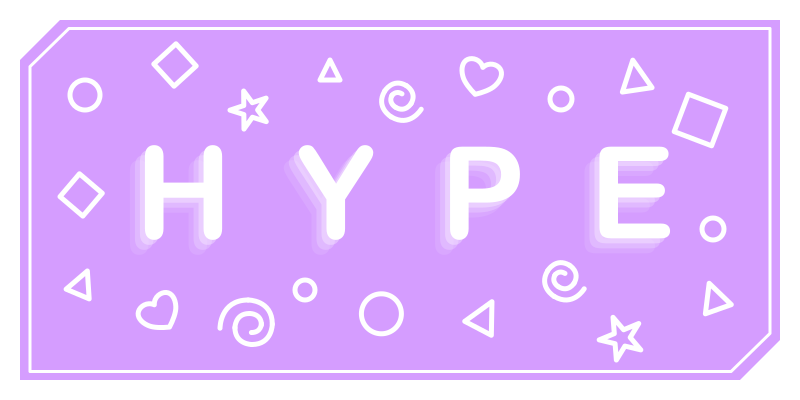

    <b>Software that powers communities</b>
     
    <i>Please see license & contributions sections</i>

# About
Hype is a CMS catered to features of specific games such the case for Geometry Dash integrations allowing the site to pull data from official servers and act as an authority to link user's accounts

Current sites powered by this software:
- https://hyperbolus.net - Geometry Dash
    - https://profile.gd
- https://hyperdodger.com - Soundodger
- https://userlevels.com - The Impossible Game 1 & 2

## Stack
The current codebase is a multi-tenant one meant for hosting several "sites" on a single installation. No support will be given to anyone attempting to set up the project. Please do not modify redistribute etc.

# Features
- Forum
- Reviews and ratings
- Profiles
- Messaging
- Cosmetics
- Community workshop for mods

# Usage
You can do whatever you want with this locally but this software is not licensed and I give no permission for redistribution nor will I provide support for people attempting to setup an instance of the site for public use.

## I want to use this for my game's community
Whether you're a game dev or community leader, reach out to see if Hype would be a good fit for your community

# Contributing
We are currently not accepting code contributions, although you can still request features and report bugs

# License
Hype is licensed under
